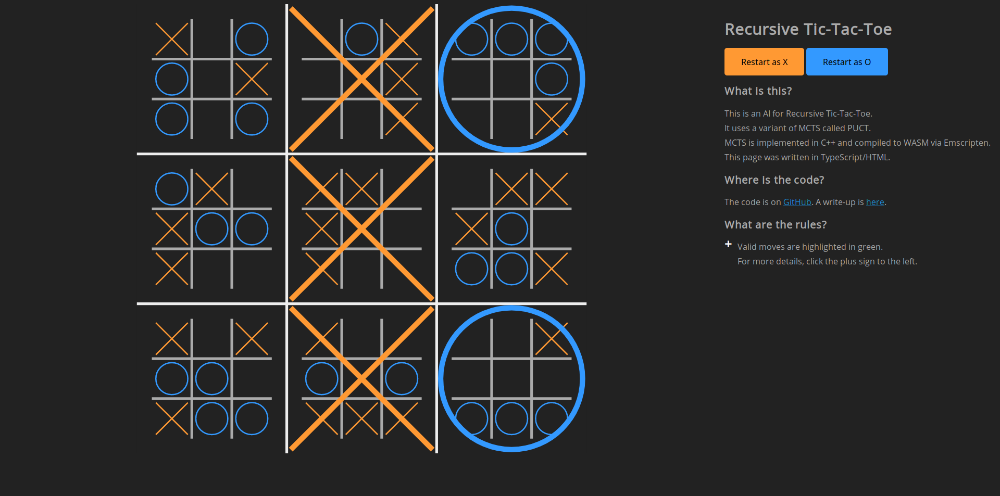

# MCTS Recursive Tic-Tac-Toe

## What is this?
This is an AI for Recursive Tic-Tac-Toe.
It uses a variant of MCTS called PUCT.
MCTS is implemented in C++ and compiled to WASM via Emscripten.
This page was written in TypeScript/HTML.
## Where is the code?
You're looking at it! A write-up is coming soon .
## What are the rules?
- The board is a 3×3 grid of supercells.
- Each supercell contains a normal tic-tac-toe board.
- Whenever a player gets a three-in-a-row in a small grid, they "win" that supercell.
- The game ends when a player gets three-in-a-row on the supergrid or when the supergrid is tied.
- X starts the game. They may pick any location to begin.
- Each player then makes their move in the big cell aligned to the tiny cell that their opponent picked.
  For example, if X moves in the bottom-right of the center square, the squares highlighted in green are valid for O:

    <svg viewBox="0 0 337.5 337.5" style="width: 50%; height: auto;">
        <line x1="41.25" y1="11.25" x2="41.25" y2="101.25" style="stroke:#AAAAAA; stroke-width:2"></line>
        <line x1="71.25" y1="11.25" x2="71.25" y2="101.25" style="stroke:#AAAAAA; stroke-width:2"></line>
        <line x1="11.25" y1="41.25" x2="101.25" y2="41.25" style="stroke:#AAAAAA; stroke-width:2"></line>
        <line x1="11.25" y1="71.25" x2="101.25" y2="71.25" style="stroke:#AAAAAA; stroke-width:2"></line>
        <line x1="41.25" y1="123.75" x2="41.25" y2="213.75" style="stroke:#AAAAAA; stroke-width:2"></line>
        <line x1="71.25" y1="123.75" x2="71.25" y2="213.75" style="stroke:#AAAAAA; stroke-width:2"></line>
        <line x1="11.25" y1="153.75" x2="101.25" y2="153.75" style="stroke:#AAAAAA; stroke-width:2"></line>
        <line x1="11.25" y1="183.75" x2="101.25" y2="183.75" style="stroke:#AAAAAA; stroke-width:2"></line>
        <line x1="41.25" y1="236.25" x2="41.25" y2="326.25" style="stroke:#AAAAAA; stroke-width:2"></line>
        <line x1="71.25" y1="236.25" x2="71.25" y2="326.25" style="stroke:#AAAAAA; stroke-width:2"></line>
        <line x1="11.25" y1="266.25" x2="101.25" y2="266.25" style="stroke:#AAAAAA; stroke-width:2"></line>
        <line x1="11.25" y1="296.25" x2="101.25" y2="296.25" style="stroke:#AAAAAA; stroke-width:2"></line>
        <line x1="153.75" y1="11.25" x2="153.75" y2="101.25" style="stroke:#AAAAAA; stroke-width:2"></line>
        <line x1="183.75" y1="11.25" x2="183.75" y2="101.25" style="stroke:#AAAAAA; stroke-width:2"></line>
        <line x1="123.75" y1="41.25" x2="213.75" y2="41.25" style="stroke:#AAAAAA; stroke-width:2"></line>
        <line x1="123.75" y1="71.25" x2="213.75" y2="71.25" style="stroke:#AAAAAA; stroke-width:2"></line>
        <line x1="153.75" y1="123.75" x2="153.75" y2="213.75" style="stroke:#AAAAAA; stroke-width:2"></line>
        <line x1="183.75" y1="123.75" x2="183.75" y2="213.75" style="stroke:#AAAAAA; stroke-width:2"></line>
        <line x1="123.75" y1="153.75" x2="213.75" y2="153.75" style="stroke:#AAAAAA; stroke-width:2"></line>
        <line x1="123.75" y1="183.75" x2="213.75" y2="183.75" style="stroke:#AAAAAA; stroke-width:2"></line>
        <line x1="153.75" y1="236.25" x2="153.75" y2="326.25" style="stroke:#AAAAAA; stroke-width:2"></line>
        <line x1="183.75" y1="236.25" x2="183.75" y2="326.25" style="stroke:#AAAAAA; stroke-width:2"></line>
        <line x1="123.75" y1="266.25" x2="213.75" y2="266.25" style="stroke:#AAAAAA; stroke-width:2"></line>
        <line x1="123.75" y1="296.25" x2="213.75" y2="296.25" style="stroke:#AAAAAA; stroke-width:2"></line>
        <line x1="266.25" y1="11.25" x2="266.25" y2="101.25" style="stroke:#AAAAAA; stroke-width:2"></line>
        <line x1="296.25" y1="11.25" x2="296.25" y2="101.25" style="stroke:#AAAAAA; stroke-width:2"></line>
        <line x1="236.25" y1="41.25" x2="326.25" y2="41.25" style="stroke:#AAAAAA; stroke-width:2"></line>
        <line x1="236.25" y1="71.25" x2="326.25" y2="71.25" style="stroke:#AAAAAA; stroke-width:2"></line>
        <line x1="266.25" y1="123.75" x2="266.25" y2="213.75" style="stroke:#AAAAAA; stroke-width:2"></line>
        <line x1="296.25" y1="123.75" x2="296.25" y2="213.75" style="stroke:#AAAAAA; stroke-width:2"></line>
        <line x1="236.25" y1="153.75" x2="326.25" y2="153.75" style="stroke:#AAAAAA; stroke-width:2"></line>
        <line x1="236.25" y1="183.75" x2="326.25" y2="183.75" style="stroke:#AAAAAA; stroke-width:2"></line>
        <line x1="266.25" y1="236.25" x2="266.25" y2="326.25" style="stroke:#AAAAAA; stroke-width:2"></line>
        <line x1="296.25" y1="236.25" x2="296.25" y2="326.25" style="stroke:#AAAAAA; stroke-width:2"></line>
        <line x1="236.25" y1="266.25" x2="326.25" y2="266.25" style="stroke:#AAAAAA; stroke-width:2"></line>
        <line x1="236.25" y1="296.25" x2="326.25" y2="296.25" style="stroke:#AAAAAA; stroke-width:2"></line>
        <line x1="112.5" y1="0" x2="112.5" y2="337.5" style="stroke:#EEEEEE; stroke-width:2"></line>
        <line x1="225" y1="0" x2="225" y2="337.5" style="stroke:#EEEEEE; stroke-width:2"></line>
        <line x1="0" y1="112.5" x2="337.5" y2="112.5" style="stroke:#EEEEEE; stroke-width:2"></line>
        <line x1="0" y1="225" x2="337.5" y2="225" style="stroke:#EEEEEE; stroke-width:2"></line>
        <line x1="186.75" y1="186.75" x2="210.75" y2="210.75" style="stroke:#FF9933; stroke-width:1"></line>
        <line x1="210.75" y1="186.75" x2="186.75" y2="210.75" style="stroke:#FF9933; stroke-width:1"></line>
        <rect x="236.25" y="236.25" width="30" height="30" opacity="0.1" fill="#009933" id="2 2 0 0"></rect>
        <rect x="266.25" y="236.25" width="30" height="30" opacity="0.1" fill="#009933" id="2 2 0 1"></rect>
        <rect x="296.25" y="236.25" width="30" height="30" opacity="0.1" fill="#009933" id="2 2 0 2"></rect>
        <rect x="236.25" y="266.25" width="30" height="30" opacity="0.1" fill="#009933" id="2 2 1 0"></rect>
        <rect x="266.25" y="266.25" width="30" height="30" opacity="0.1" fill="#009933" id="2 2 1 1"></rect>
        <rect x="296.25" y="266.25" width="30" height="30" opacity="0.1" fill="#009933" id="2 2 1 2"></rect>
        <rect x="236.25" y="296.25" width="30" height="30" opacity="0.1" fill="#009933" id="2 2 2 0"></rect>
        <rect x="266.25" y="296.25" width="30" height="30" opacity="0.1" fill="#009933" id="2 2 2 1"></rect>
        <rect x="296.25" y="296.25" width="30" height="30" opacity="0.1" fill="#009933" id="2 2 2 2"></rect>
    </svg>
                    
- If your opponent makes a move that would cause you to play in a supercell that is won or tied, you get to freely choose amongst all of the availiable cells on the board. 